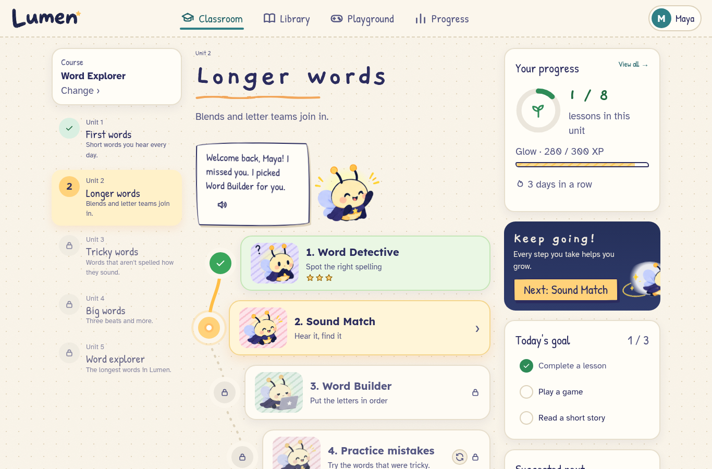
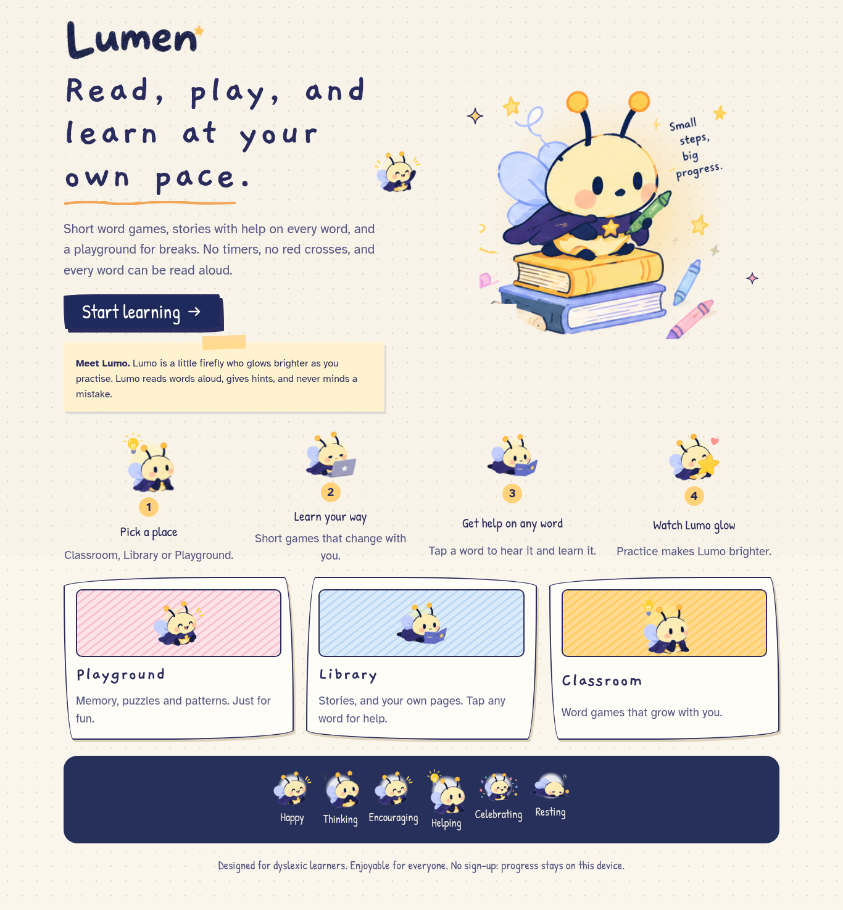
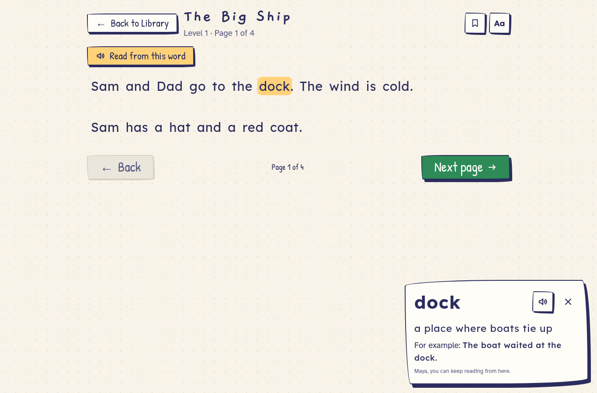
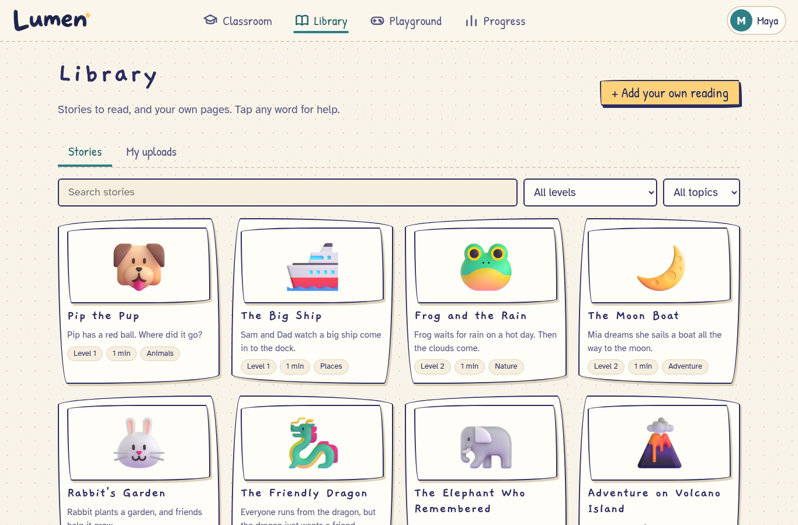
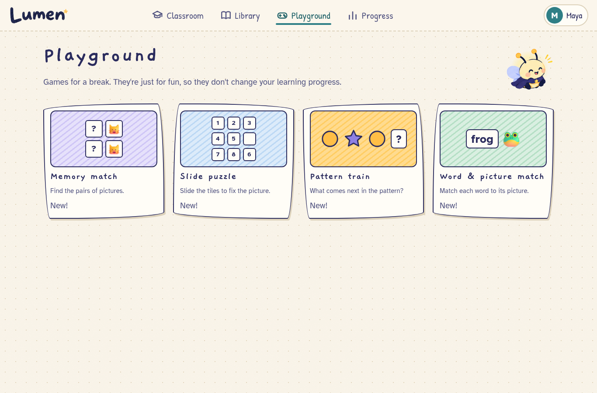
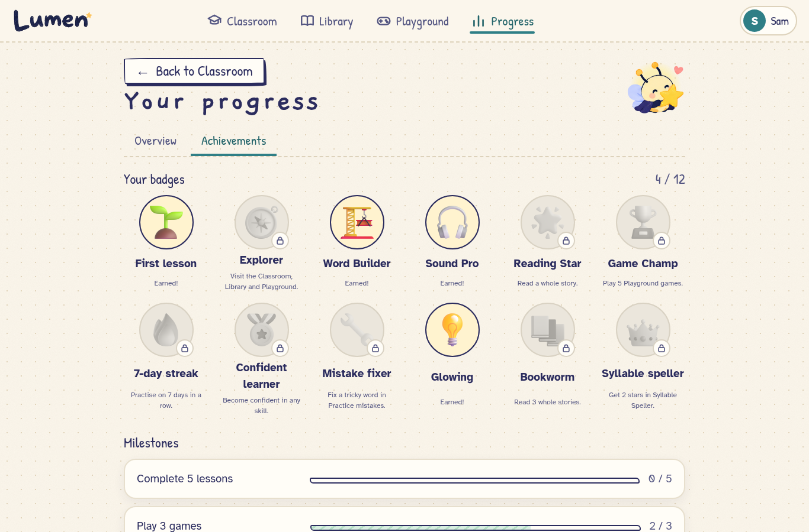

# Lumen

**Read, play, and learn at your own pace.** Lumen is a reading, learning and play app for children aged about 7 to 14, designed around dyslexic learners and enjoyable for everyone. Lumo, a little crayon firefly, guides every step.



> Lumen is practice. It is not a test, a diagnosis or a treatment, and never says otherwise.

## What's inside

| Section | What it does |
|---|---|
| **Hero page** | A short, skippable opening: Lumo flies in, its glow reveals the wordmark, and it settles on a stack of books. Returning learners get a quick hello and a "Continue learning" link. |
| **Classroom** | The main learning place. Four courses (Word Explorer, Sound Lab, Spelling Studio, Look Closely), each a sequence of units with a winding lesson path: game rounds, mistake review, glow chest, mixed practice and a unit challenge. Plus an overview: continue, suggested next, today's goals, skills, Lumo's tip. |
| **Classroom games** | Word Detective, Sound Match, Word Builder and Syllable Speller (Orton-Gillingham style), adaptive and untimed. Missed words come back at the end of a round (Duolingo-style) and in **Practice mistakes**. |
| **Classroom activities** | Word twins (ship/shop), Letter teams, Riddles, Sentence order, Story questions, Write a sentence. Each **teaches first** with a worked example, then practises with hints, explanations, retry, previous/next and a completion screen. |
| **Library** | Stories with covers, levels, search, filters, "Continue reading", bookmarks and saved position; and **My uploads**: paste text, `.txt`, PDF, or a photo (printed or handwritten), with a review screen before reading. |
| **Reader** | Every word is one interactive unit (tap, click or keyboard). Word help shows the exact word, a short meaning *for this sentence*, an illustration where it helps, an example and a "say it" button. Read-aloud with pause/resume/stop and speed; word highlighting only when the voice reports real timings. Text size, spacing, width and paragraph focus. |
| **Playground** | Memory match, Slide puzzle, Pattern train, Word & picture match. No timers. Scores are kept apart from learning progress. |
| **Progress** | Lessons, stars, streak, skills, 12 badges and milestones. |

| | |
|---|---|
|  |  |
|  |  |
|  |  |

Accessibility: no timers, no red, every instruction can be read aloud; Lexend / OpenDyslexic / Atkinson fonts; three text sizes; four backgrounds including dark; reduced motion (follows the device); full keyboard play (press **?** for every shortcut); bottom navigation and large touch targets on phones.

## Run it

```bash
npm install
cp .env.example .env        # optional keys, see below
npm run dev                 # http://localhost:5173
```

Production: `npm run build && npm start` (serves on port 4173, reads the same `.env`).

Press **Shift + D** in the Classroom to load a lived-in demo learner ("Maya").

### System tools (for uploads)

| Tool | Used for | Fedora | Debian/Ubuntu |
|---|---|---|---|
| Tesseract (English) | printed text in photos and scanned PDF pages | `tesseract tesseract-langpack-eng` | `tesseract-ocr` |
| Poppler | text inside PDFs, page rendering | `poppler-utils` | `poppler-utils` |
| ffmpeg | shrinking large photos; building the voice pack | `ffmpeg` | `ffmpeg` |

Without them, the Library still works for stories, pasted text and `.txt` files, and the upload screen says exactly what's missing.

### Keys (`.env`, all optional, all server-side)

| Variable | Enables |
|---|---|
| `GROQ_API_KEY` | AI tips after a miss, round insights, the grown-up summary and home ideas, word explanations for uploaded text, and **handwriting reading** (vision model). Model auto-selected from what the key can use (`openai/gpt-oss-120b` first); override with `GROQ_MODEL`. |
| `FISH_API_KEY` + `FISH_VOICE_ID` | The natural voice, using **Fish Audio** on the free model `s2.1-pro-free` (first choice). Pick a voice in the Fish Audio library and copy its id. |
| `GOOGLE_TTS_API_KEY` *or* `GOOGLE_APPLICATION_CREDENTIALS` | The natural voice with **Google Cloud Text-to-Speech Chirp 3 HD**, used when Fish isn't set. |
| *(Groq)* | Next fallback: Groq Orpheus (terms accepted once in the Groq console; about 100 speech requests a day on the free plan). |
| *(always on)* | **Lumen's own voice**, made on the server with Piper (natural, offline: set `PIPER_MODEL`) or eSpeak. Used whenever a cloud voice can't answer, so Lumo is never silent. |

**Why the server speaks.** Chromium-based browsers on Linux (Chrome, Brave, Chromium) have *no* built-in voices unless started with `--enable-speech-dispatcher`, so Lumen plays audio made by the server instead of relying on the browser. Firefox, Safari and Chrome on Windows/macOS/Android also have their own voices, used only as the last fallback.

The server prints what's on at startup, and **Settings → Lumo's AI** shows the same status, with a "Check again" button.

What's sent: bank words, tags and aggregate numbers for text AI; Lumo's own lines for speech (the learner's name is always removed); uploaded files only to read their text (processed in memory, never stored). Everything else stays in the browser.

### Content scripts

```bash
npm run voices       # pre-generate the natural-voice pack (every fixed line, word and syllable) into public/voice/
npm run dictionary   # draft word explanations for story words (AI, validated; review the output)
npm run pictures     # download word illustrations (Fluent 3D, MIT) into public/pictures/
npm run icons        # illustrations for word help and badge art
```

## Develop

```bash
npm test            # 190 unit tests: engine, courses, practice, speller, segmentation, learning records, games, server, extraction helpers
npm run typecheck
npm run smoke       # with the dev server running: 18 real-browser journeys (see below)
```

`npm run smoke` plays these journeys in headless Chrome, with no test-only hooks: hero → onboarding → Classroom; a full lesson round; refresh keeps progress; an activity with teaching and completion; Playground games with replay and pause (and a check that games don't touch reading mastery); story → whole-word help → pronunciation → back with filters kept; reader keyboard; paste text → reader; **a freshly generated picture through real OCR**; **a freshly generated PDF through the embedded-text path**; section switching keeps state; browser back/forward; shortcuts; the grown-ups gate; "Forget this device" clears progress and uploads; reduced motion; phone layout and touch.

## Project layout

```
src/
  router.tsx           History API routes; each section remembers its last page
  engine/              adaptive engine, courses & units, practice (mistakes, second chances, mixed rounds),
                       progression, badges, speller, report: pure, tested logic
  classroom/           activities (content + screen) and learning records per skill
  library/             story bank, whole-word segmentation, reader, word help, uploads (IndexedDB), extraction client
  playground/          the four games (logic is tested separately from the UI)
  screens/             Hero, Classroom, Progress, game screens, round complete, settings, grown-ups
  services/            voice (Google / Groq / device, voice pack, cache), AI client, sound effects
server/                Groq text + speech, Google Chirp 3 HD, extraction (Tesseract, Poppler, vision), .env loader
docs/spec/             product spec, including 10-syllable-speller.md
```

## Honest notes

- **No accounts.** Lumen keeps progress on the device by design (the spec forbids sign-in for children's privacy). The account menu offers *Exit to start page* and *Forget this device*, which erases progress, uploads and caches. There is no server-side login to end.
- **No database.** Stories live in a versioned content file with draft/published status. Drafts show only in development, labelled "Draft: not reviewed".
- **Handwriting** needs `GROQ_API_KEY`; without it Lumen uses the printed-text reader and says so. Flagged words come from real signals: Tesseract's confidence, or disagreement between the two readers. No confidence numbers are invented.
- **Word explanations** for story words were drafted by AI and checked by script; a few were corrected by hand. A person should still review them.
- **The voice pack** is partly built (Groq's free limits). With a Fish Audio or Google key, `npm run voices` builds the rest in one run.
- **Fish Audio and Google voices** are implemented and tested against mocked responses, but haven't been called live (no keys were available while building).
