<div align="center">


### Read, play, and learn at your own pace.

A playful reading, spelling and story app built with dyslexic learners in mind, and enjoyable for everyone.<br />
Lumo, a little crayon firefly, cheers you on, helps when you're stuck, and never minds a mistake.

<p>
  <a href="https://lumen-learn.onrender.com"></a>
</p>

<p>
  <a href="https://github.com/Anasarfeen123/lumen-learn/actions/workflows/ci.yml"></a>
  
  
  
  <a href="LICENSE"></a>
</p>
<p>
  
  
  
  
  
  
  
</p>
<p>
  
  
  
  
</p>

<a href="https://lumen-learn.onrender.com">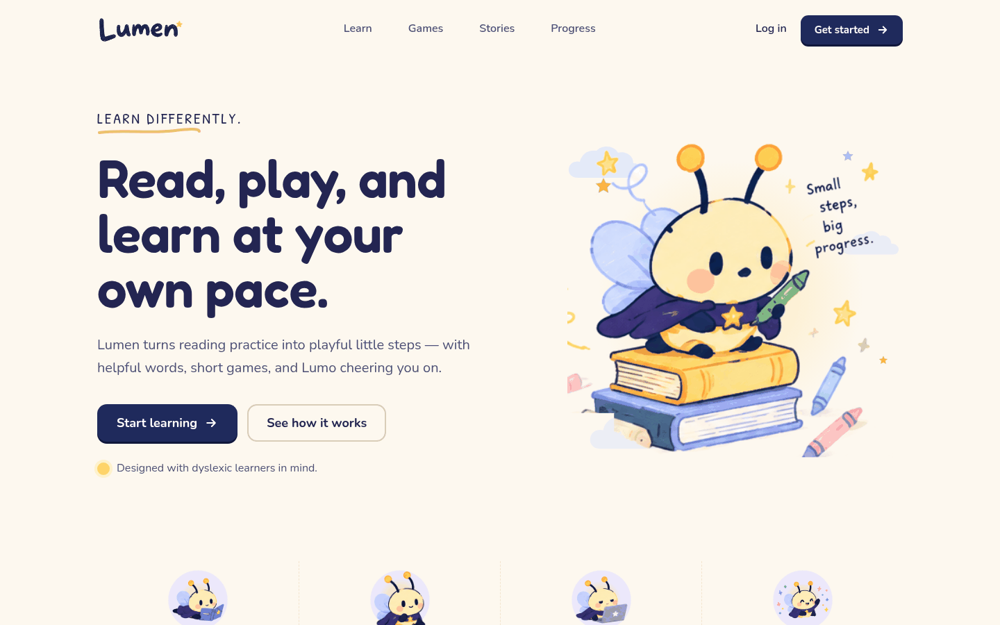</a>

**[Try it live](https://lumen-learn.onrender.com)** · [Features](#-features) · [Screenshots](#-screenshots) · [Run it](#-run-it-locally) · [Deploy](#-deploy) · [How it works](#-how-it-works)

</div>

> [!NOTE]
> Lumen is **practice**, not a test, a diagnosis or a treatment, and it never says otherwise.
> The live demo runs on a free server that sleeps when idle: the first visit after a quiet spell can take about a minute to wake up.

---

## ✨ Features

<table>
<tr>
<td width="50%" valign="top">

### 🎓 Classroom
- **Four courses** (Word Explorer, Sound Lab, Spelling Studio, Look Closely), each a path of units.
- A **flowing lesson path** with game rounds, mistake review, glow chests, mixed practice and unit challenges.
- **Four adaptive games**: Word Detective, Sound Match, Word Builder, and **Syllable Speller** (Orton-Gillingham style: spell one beat at a time).
- **Second chances**: missed words come back at the end of a round, Duolingo-style, and wait in *Practice mistakes*.
- **Six teach-first activities** (Word twins, Letter teams, Riddles, Sentence order, Story questions, Write a sentence). Each shows a worked example first, then practice with hints and explanations.

</td>
<td width="50%" valign="top">

### 📚 Library
- **Stories** with covers, levels, topics, search, filters, bookmarks and "Continue reading".
- **Whole-word reader**: tap any part of a word and the *whole word* is selected. Word help shows a short meaning *for this sentence*, a picture, an example and "say it".
- **Read-aloud** with pause, resume and speed. Words are only highlighted when the voice reports real timings.
- **Bring your own reading**: paste text, or upload `.txt`, PDF, or a photo (printed *or handwritten*). You check the text before reading, and the original, raw and confirmed versions are all kept.

</td>
</tr>
<tr>
<td valign="top">

### 🤖 A learning buddy that adapts
- **Adaptive engine**: tracks mastery per skill (letter pairs, vowel teams, look-alike letters, silent letters…) and picks what comes next.
- **Lumo's plan for you**: two or three steps a day, each with a reason. The AI may only choose from steps the app offers, and a rule-based plan steps in when it can't.
- **Stories Lumo writes for you**, about what *you* like, using the words *you're* practising, checked for length, kindness and target words.
- **"How was this story?"** feedback steers what Lumo suggests next.
- Smart hints that never give the answer away.

</td>
<td valign="top">

### 🎮 Playground & progress
- **Playground**: Memory match, Slide puzzle, Pattern train, Word & picture match. Just for fun, so scores never count as learning.
- **Progress**: lessons, stars, streaks, skills, **12 badges** and milestones.
- **Lumo grows**: glow stages, hats and colours to unlock.
- **Notes for grown-ups**: the week in numbers, a day-by-day chart, what's getting stronger and what's still tricky (with words to practise), suggested practice and ideas for home.
- Behind a **3-second hold**, not a password: it keeps young learners from wandering in, and asks again every time.

</td>
</tr>
<tr>
<td valign="top">

### 👤 Accounts
- **Sign up, log in, log out, delete account.** Or **try it as a guest** (progress stays on the device), and keep that progress when you make an account.
- Progress, uploads, interests and Lumo's stories are **saved to the account** and follow the learner to any device.
- Two devices can't silently overwrite each other (version-checked saves).
- Friendly log-in and sign-up pages: show/hide password, a live length check, clear messages.

</td>
<td valign="top">

### 🗣️ Natural voices
- **Fish Audio** (free model `s2.1-pro-free`), **Google Chirp 3 HD** or **Groq Orpheus**, whichever is set up.
- A **pre-built voice pack** for common lines, words and syllables, so frequent speech is instant (`npm run voices` fills in the rest).
- **Lumen's own voice** (Piper or eSpeak) on the server, used whenever a cloud voice can't answer, so Lumo is never silent, even in browsers with no voices of their own.

</td>
</tr>
</table>

### ♿ Built for comfortable reading

| | |
|---|---|
| **Fonts** | Lexend, OpenDyslexic or Atkinson Hyperlegible |
| **Look** | Three text sizes, four backgrounds (including dark), adjustable spacing and line width, paragraph focus |
| **Kindness** | No timers and no red crosses. Mistakes get hints, and missed words come back gently later. |
| **Sound** | Every instruction and word can be heard |
| **Motion** | Gentle page slides, sparkles for real wins, a trail that draws itself. All of it switches off with the device's *reduce motion* setting, or in Settings. |
| **Keyboard** | Full keyboard play. Press <kbd>?</kbd> for every shortcut. |
| **Phones** | Bottom navigation, large touch targets, no sideways scrolling |

<details>
<summary><b>⌨️ Keyboard shortcuts</b></summary>

| Keys | Does |
|---|---|
| <kbd>?</kbd> | Show or hide the shortcuts |
| <kbd>Alt</kbd> + <kbd>1</kbd> / <kbd>2</kbd> / <kbd>3</kbd> | Playground / Library / Classroom |
| <kbd>Alt</kbd> + <kbd>0</kbd> | Start page |
| <kbd>Alt</kbd> + <kbd>S</kbd> | Settings |
| <kbd>1</kbd>–<kbd>4</kbd> | Pick an answer |
| <kbd>Enter</kbd> | Check. Press again to continue. |
| <kbd>Space</kbd> | Hear the word again |
| <kbd>←</kbd> <kbd>→</kbd> | Move between syllable boxes (Syllable Speller) |
| <kbd>Esc</kbd> | Leave the round · close word help |
| Arrow keys, then <kbd>Enter</kbd> | Move word by word in the reader, then open word help |
| <kbd>Shift</kbd> + <kbd>D</kbd> | Load the demo learner "Maya" (in the Classroom) |

</details>

---

## 📸 Screenshots

| Classroom with Lumo's plan | Whole-word reader |
|---|---|
|  | 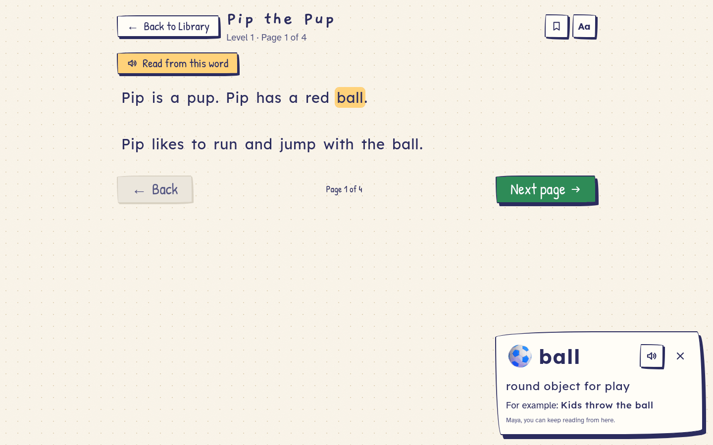 |
| **Library and Lumo's stories** | **Syllable Speller** |
|  | 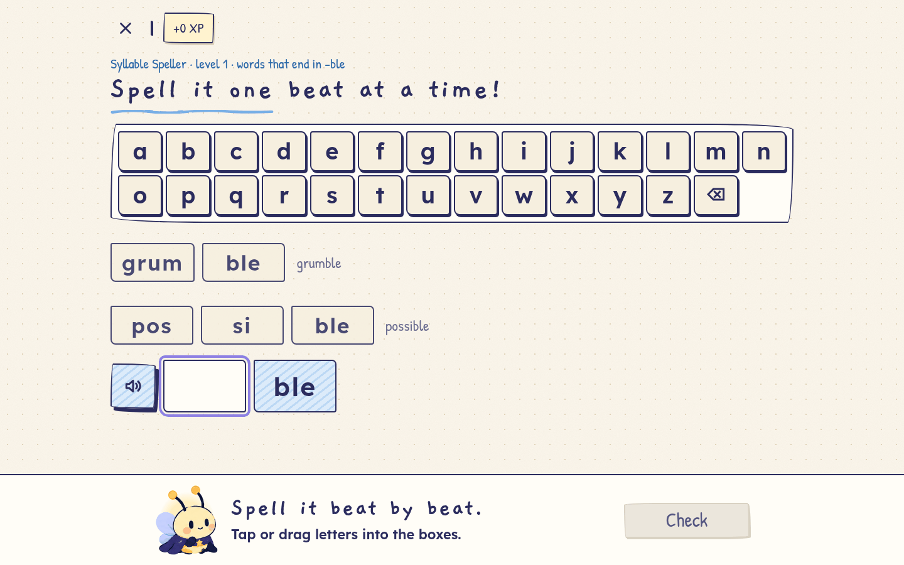 |
| **Teach first, then practise** | **Upload a page, check the text** |
|  | 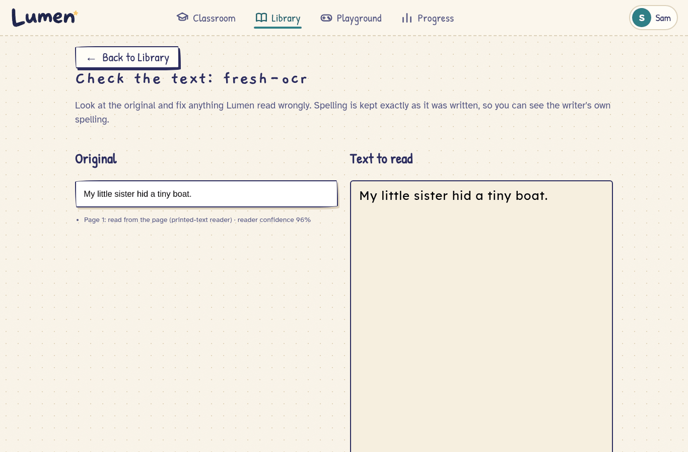 |
| **About me: what Lumo knows** | **Progress and badges** |
| 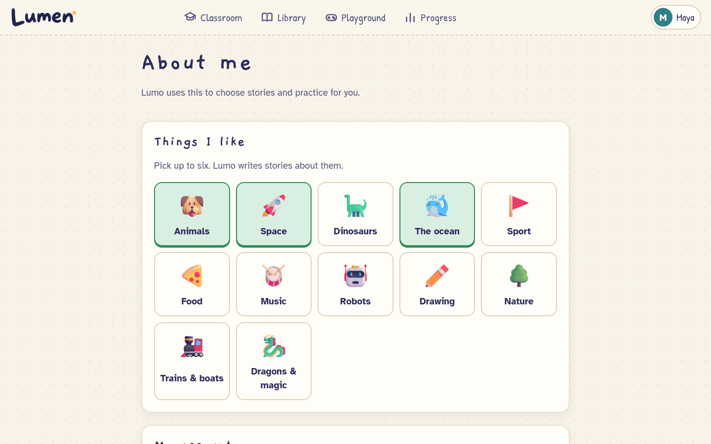 | 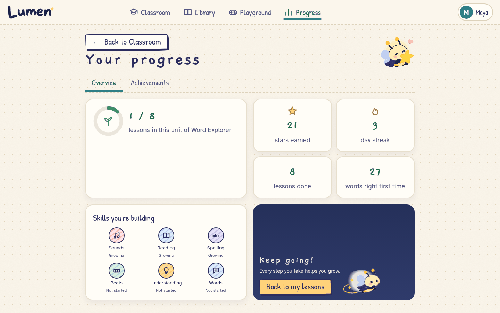 |
| **Playground** | **Log in / create account** |
|  | 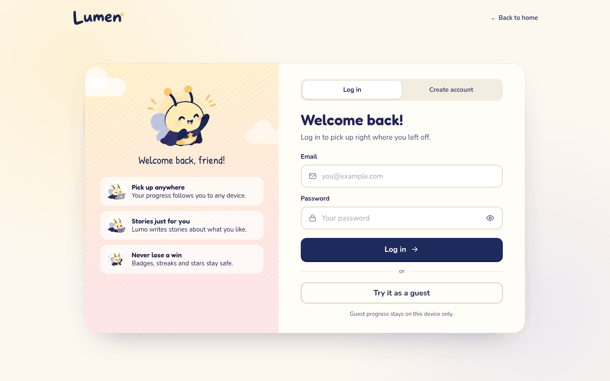 |
| **Notes for grown-ups** | **The hold-to-open gate** |
| 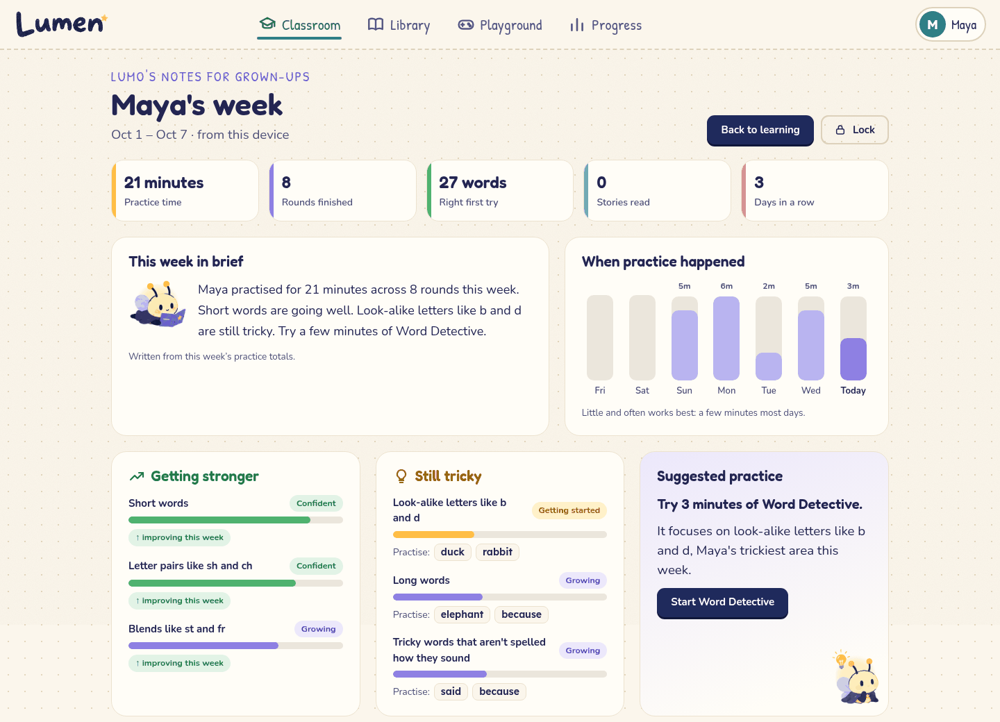 | 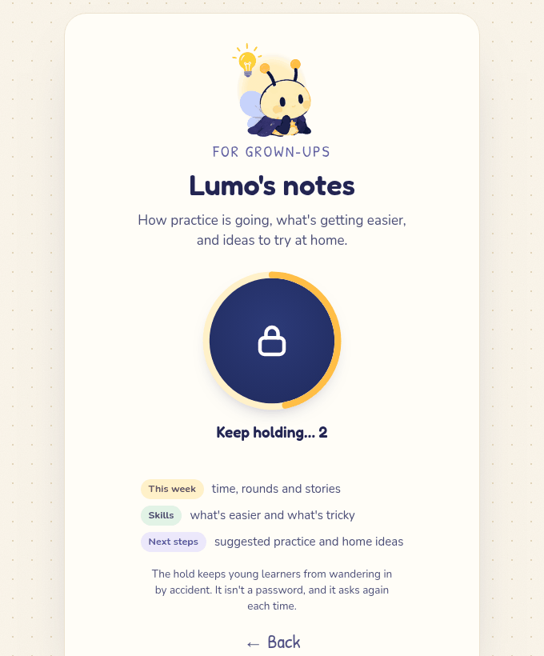 |

<p align="center"><b>On a phone</b><br />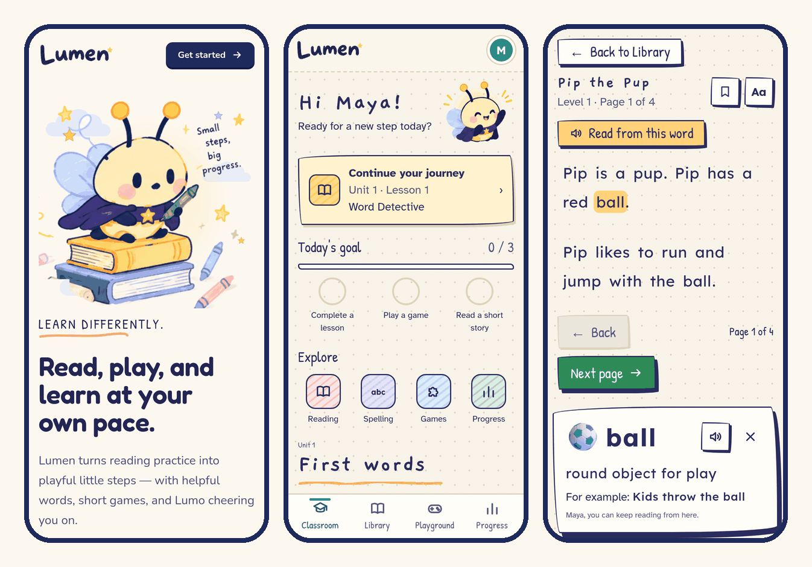</p>

<details>
<summary><b>The whole landing page</b></summary>
<p align="center">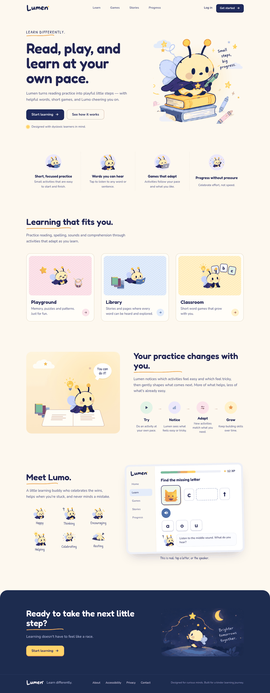</p>
</details>

---

## 🚀 Run it locally

**Requires** Node 22.13 or newer.

```bash
git clone https://github.com/Anasarfeen123/lumen-learn.git
cd lumen-learn
npm install
cp .env.example .env      # optional: add AI and voice keys (see below)
npm run dev               # → http://localhost:5173
```

Production build: `npm run build && npm start` (port 4173, or `PORT`).

Accounts are stored in `data/lumen.db` (a local SQLite file) unless `TURSO_DATABASE_URL` is set.

### Optional system tools (for reading uploaded pages)

| Tool | Used for | Fedora | Debian / Ubuntu |
|---|---|---|---|
| Tesseract | Printed text in photos and scanned PDFs | `tesseract tesseract-langpack-eng` | `tesseract-ocr` |
| Poppler | Text inside PDFs, rendering pages | `poppler-utils` | `poppler-utils` |
| ffmpeg | Shrinking large photos, building the voice pack | `ffmpeg` | `ffmpeg` |
| eSpeak NG | The always-available server voice | `espeak-ng` | `espeak-ng` |

Without them, stories, pasted text and `.txt` files still work, and the upload screen says exactly what's missing. The Docker image includes all of them.

### Configuration (`.env`, all optional, all server-side)

| Variable | What it turns on |
|---|---|
| `GROQ_API_KEY` | Lumo's AI: hints, round insights, the daily plan, stories written for the learner, word explanations for uploads, the grown-ups summary, and **reading handwriting**. The best available model is chosen automatically (override with `GROQ_MODEL`). |
| `FISH_API_KEY` · `FISH_VOICE_ID` | Natural voice from **Fish Audio** (`s2.1-pro-free`). The voice id is optional. |
| `GOOGLE_TTS_API_KEY` or `GOOGLE_APPLICATION_CREDENTIALS` | Natural voice from **Google Chirp 3 HD**, if Fish isn't set |
| `PIPER_MODEL` | A natural *offline* server voice (Piper) instead of eSpeak |
| `TURSO_DATABASE_URL` · `TURSO_AUTH_TOKEN` | Keep accounts in **Turso** (hosted SQLite) instead of a local file |
| `LUMEN_DB` | Path of the local database file (default `data/lumen.db`) |

At startup the server prints what's on (database, AI, voice) without ever printing a key. **Settings → Lumo's AI** shows the same status inside the app.

---

## ☁️ Deploy

Lumen is one container: the web app, the API, text recognition and the database connection. `/healthz` reports `ok · database: turso|file`.

### Render (free): how the live demo runs

1. Create a free database at **[app.turso.tech](https://app.turso.tech)**, then copy its URL and an auth token.
2. On **[Render](https://dashboard.render.com)**: **New → Blueprint** → pick this repo. Render reads [`render.yaml`](render.yaml).
3. Paste `TURSO_DATABASE_URL`, `TURSO_AUTH_TOKEN`, `GROQ_API_KEY` and `FISH_API_KEY`, then **Apply**.

Every push to `main` redeploys automatically.

> [!NOTE]
> The free plan has a small slice of CPU. Photos and text PDFs are quick, but **scanned PDFs take about 10 seconds a page** there (under a second on a normal computer). Progress shows page by page, and a paid plan makes it much faster.

### Anywhere else

```bash
docker build -t lumen .
docker run -p 8080:8080 -v lumen-data:/data --env-file .env lumen
```

[`fly.toml`](fly.toml) is included for Fly.io (with a volume for `/data`).

> [!TIP]
> Static hosts like Vercel or Netlify can't run Lumen fully, because accounts, AI and text recognition need the server. If you only need the front end, build it with `VITE_LUMO_API=off`.

---

## 🧠 How it works

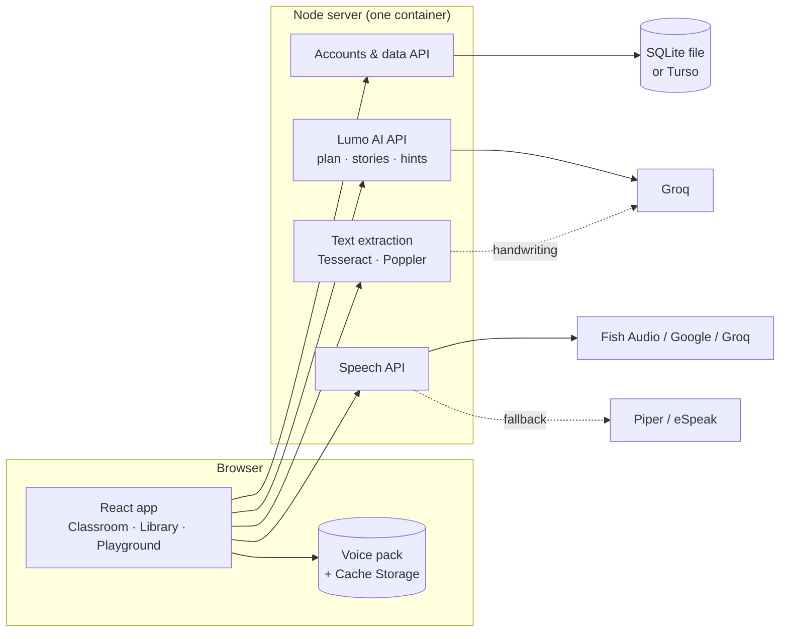

<details>
<summary><b>Privacy and safety</b></summary>

- **Passwords** are hashed with scrypt. Sessions use an `httpOnly`, `SameSite` cookie whose token is stored only as a hash. Changes require a custom header (CSRF protection), and failed logins are rate-limited.
- **Every query is scoped to the signed-in learner.** Deleting an account erases every table's rows for that learner.
- **What the AI sees**: interest topics, skill names and words from Lumen's own word list. **Never** the learner's name, email, or anything they type or upload. The learner's name is also stripped from anything spoken by a cloud voice.
- **Every AI reply is checked** before it's shown: length, banned words (no talk of tests, scores or conditions), no answers given away, only real choices picked. A template or rule-based answer is always there instead.
- **Uploaded pages**: printed text and PDFs are read on the server. Handwriting is read by a vision model (Groq) when one is set up. Text detected with low confidence is flagged for review, and no confidence numbers are made up.
- **Security headers**: a strict Content-Security-Policy, `X-Frame-Options: DENY`, and no third-party scripts or fonts.

</details>

<details>
<summary><b>Project layout</b></summary>

```
src/
  account/      sign up / log in pages, auth state, saving to the account
  personal/     interests, Lumo's daily plan, Lumo-written stories
  engine/       adaptive engine, courses & units, practice, progression, badges, speller (pure, tested)
  classroom/    teach-first activities and learning records
  library/      story bank, whole-word segmentation, reader, word help, uploads
  playground/   the four games
  screens/      landing, Classroom, Progress, game screens, settings, grown-ups
  services/     voices (pack, cache, server, device), AI client, sound effects
server/
  index.mjs         production server (static files, security headers, /healthz)
  db.mjs            SQLite / Turso via libSQL
  account-api.mjs   accounts, sessions, profile, library, uploads
  personal-api.mjs  daily plan and stories (with checks and fallbacks)
  lumo-api.mjs      hints, insights, word explanations, speech
  extract.mjs       PDF / photo / handwriting text extraction
docs/           spec, brand boards, screenshots
```

</details>

---

## 🧪 Testing

```bash
npm test             # 209 unit tests: engine, courses, practice, speller, segmentation, accounts, AI checks…
npm run typecheck
npm run smoke        # with the app running: 24 real-browser journeys
```

`npm run smoke` drives a real Chromium with no test-only hooks. It covers:
- onboarding and a full lesson round;
- **sign up → progress saved to the database → log out → Back is blocked → log in restores it**;
- interests and Lumo's plan, and deleting an account;
- teach-first activities and Playground games (checking they don't touch reading progress);
- whole-word help and pronunciation;
- **a freshly generated photo through real OCR** and **a freshly generated PDF**;
- back/forward, shortcuts, **Enter checks before it continues**, and the Classroom tab never landing on Progress or the grown-up notes;
- **the grown-ups gate**: a short press doesn't open it, a full hold does, and leaving, locking or reloading asks again;
- reduced motion and the phone layout.

The journeys run with animations on, so page transitions are exercised too.

The same suite runs in CI on every push, and against the live site.

### Content scripts

```bash
npm run voices       # pre-generate the voice pack into public/voice/
npm run dictionary   # draft word explanations for story words (AI, validated; review the output)
npm run pictures     # word illustrations (Microsoft Fluent Emoji 3D, MIT)
npm run icons        # illustrations for word help and badges
```

---

## 📝 Honest notes

- **Word explanations** for story words were drafted by AI, checked by a script and partly corrected by hand. A person should still review them.
- **The voice pack** is only partly built. With a Fish Audio or Google key, `npm run voices` fills in the rest.
- **The free server sleeps** after 15 minutes without visitors, and reads scanned PDFs slowly (about 10 seconds a page). A paid plan or another host avoids both.
- **Voices:** Fish Audio is tested live. Google Chirp 3 HD is implemented and tested against recorded responses only, since no Google key was available.
- **Animations** use the View Transitions API for page slides. Browsers without it change pages instantly; everything else still animates.
- Lumen is a learning tool, not a medical one. It never diagnoses, treats, or claims to fix dyslexia.

## 📄 License

[MIT](LICENSE) © 2026 Anas Arfeen. You're free to use, change and share Lumen; please keep the copyright notice.

Bundled third-party assets keep their own licences: Fluent Emoji illustrations (MIT, see [`public/pictures/NOTICE.md`](public/pictures/NOTICE.md)) and the fonts (SIL Open Font License).

## 🙏 Credits

- Illustrations: [Microsoft Fluent Emoji](https://github.com/microsoft/fluentui-emoji) (MIT)
- Fonts: Fredoka, Nunito, Lexend, OpenDyslexic, Atkinson Hyperlegible, Patrick Hand and Gaegu, via [Fontsource](https://fontsource.org)
- AI and speech: [Groq](https://groq.com), [Fish Audio](https://fish.audio), [Google Cloud Text-to-Speech](https://cloud.google.com/text-to-speech), [Piper](https://github.com/rhasspy/piper), [eSpeak NG](https://github.com/espeak-ng/espeak-ng)
- Text recognition: [Tesseract](https://github.com/tesseract-ocr/tesseract) and [Poppler](https://poppler.freedesktop.org)

<div align="center">
<br />
<br />
<sub>Made with care for curious minds. <i>Small steps, big progress.</i></sub>
</div>
