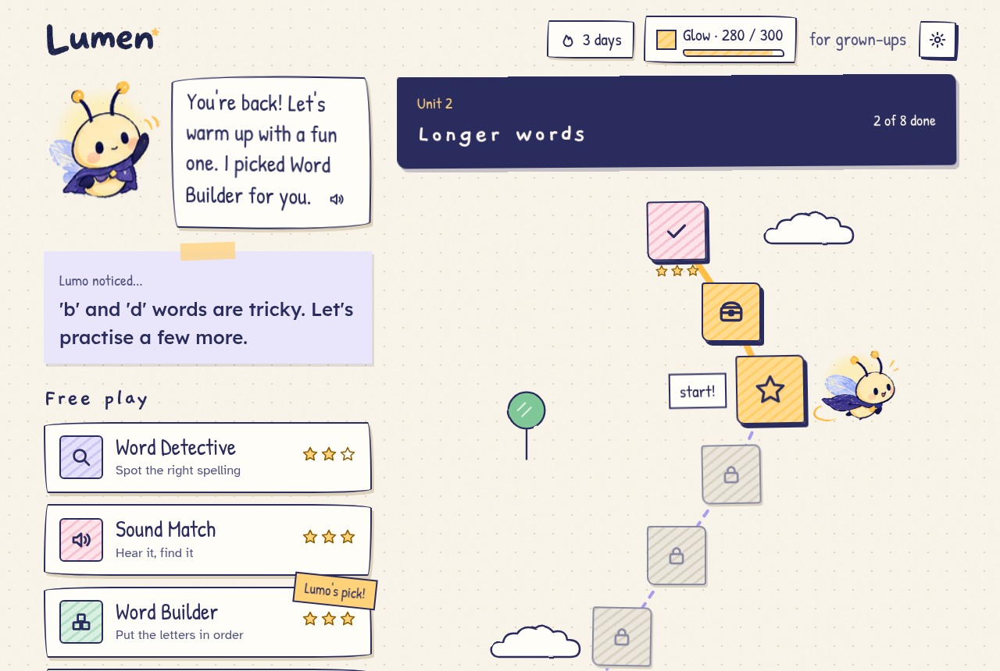
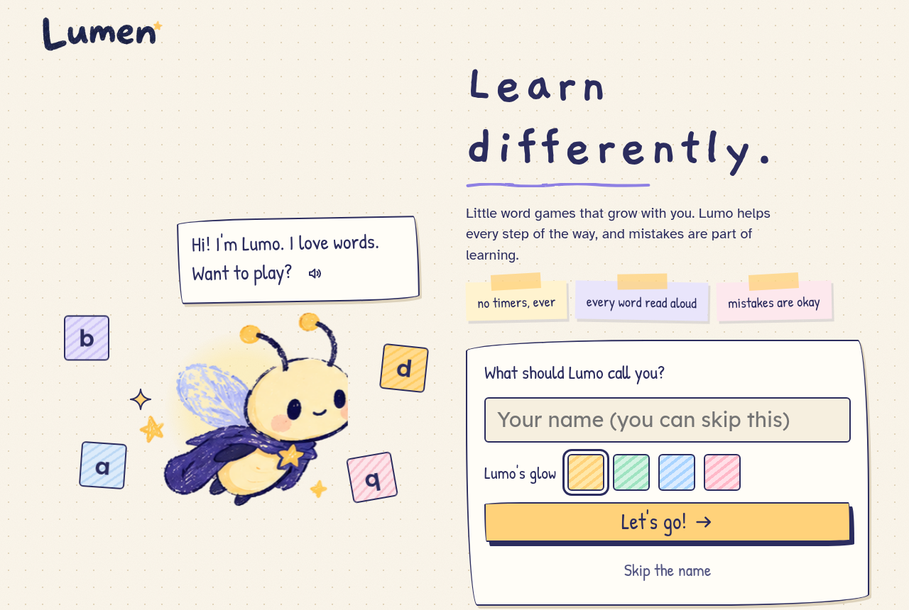
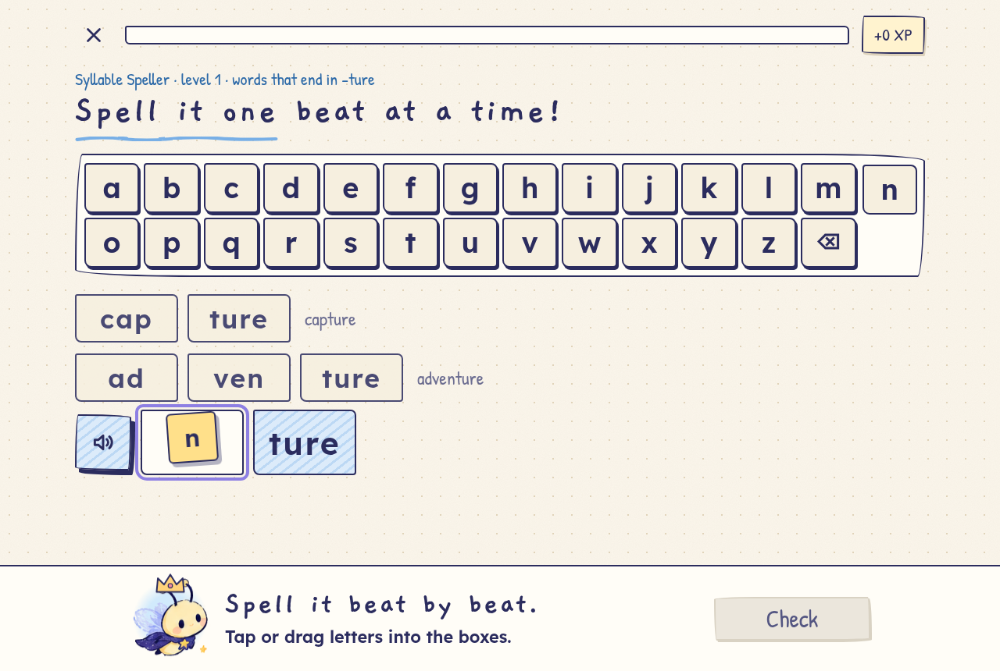
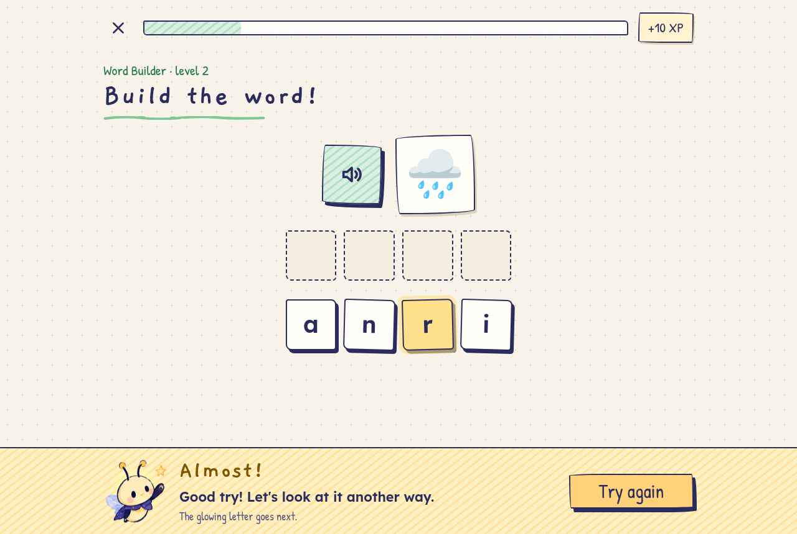
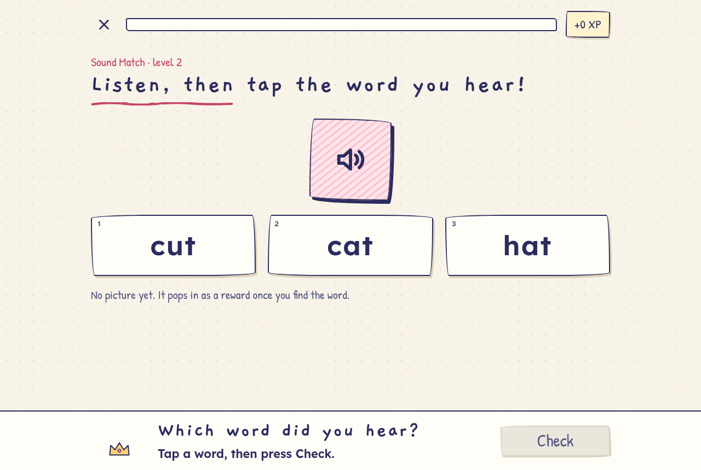
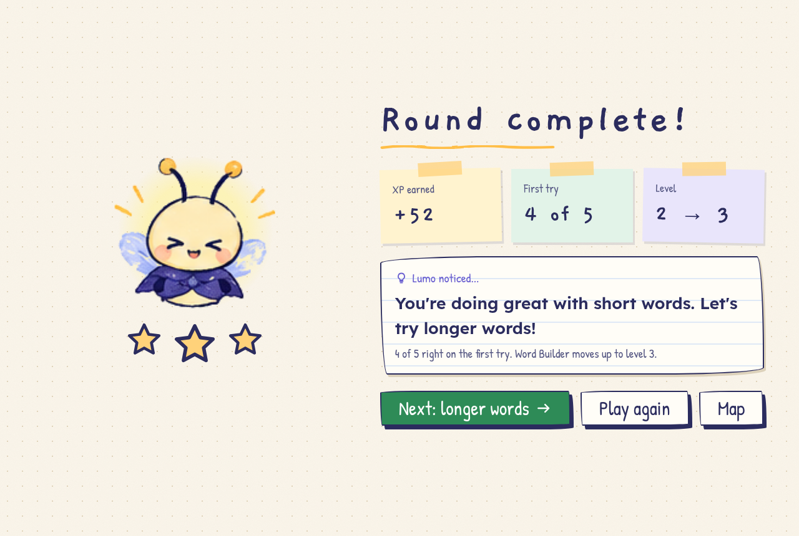
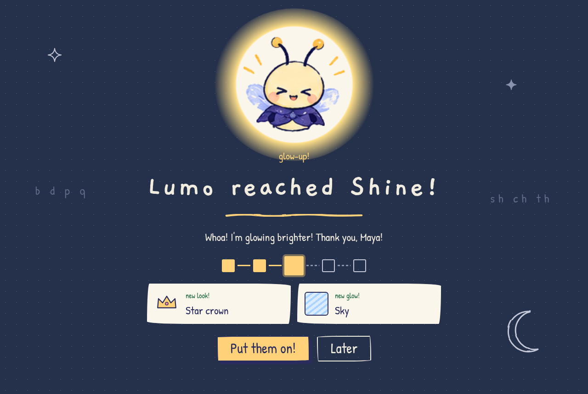
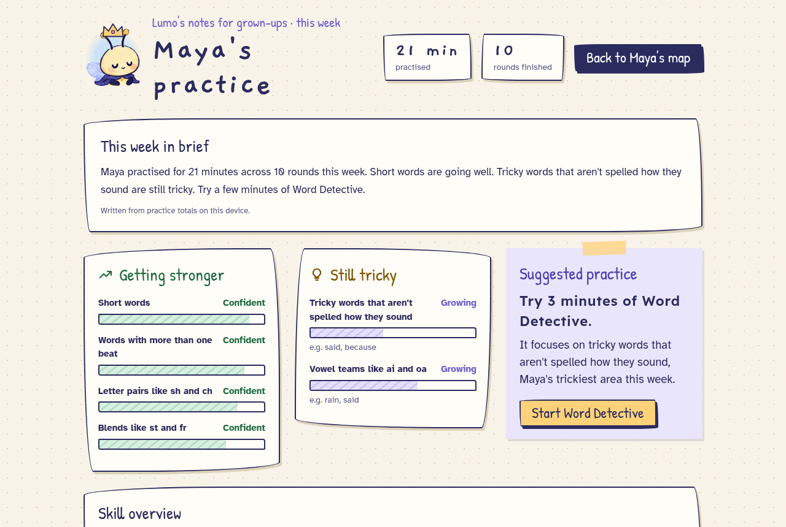
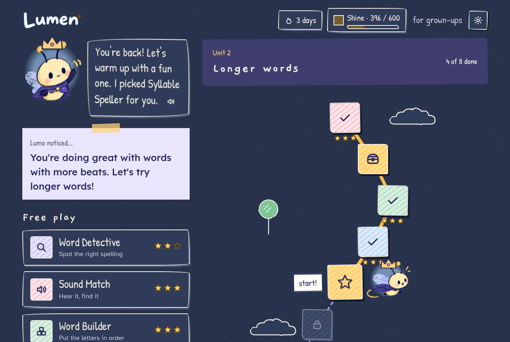

# Lumen

**Learn differently.** Lumen is a playful, adaptive literacy game for learners aged about 7 to 14 who find reading and spelling hard, including those with dyslexia. A small crayon firefly called **Lumo** guides short word games, notices what's getting easier, and adjusts what comes next.

*Designed for dyslexic learners. Enjoyable for everyone.*



> Lumen is practice. It is not a test, a diagnosis, or a treatment, and it never says otherwise.

## What's in it

- **Four games**, 5 items per round, select-then-Check, two tries per item:
  - **Word Detective**: find the word that's spelled right.
  - **Sound Match**: listen, then tap the word you hear.
  - **Word Builder**: put the letters (or syllable chunks) in order, with partial credit.
  - **Syllable Speller**: an Orton-Gillingham style activity. Lumo says the word beat by beat ("va… ca… tion") and the learner drags or taps letters from an alphabet into syllable boxes, under worked examples from the same word family (-tion, -ture, -ble, closed syllables). [Spec](docs/spec/10-syllable-speller.md).
- **An adaptive engine** in plain, deterministic code. It tracks mastery per word feature (look-alike letters, vowel teams, long words…), picks each round's words, moves game levels up or down, and writes one "Lumo noticed…" insight per round.
- **Progression that rewards effort**: XP, 1–3 stars (never 0), five glow stages, hats and glow colors in Lumo's closet, a gentle streak, glow chests on Lumo's path.
- **A grown-up view** behind a press-and-hold gate: minutes and rounds this week, *Getting stronger*, *Still tricky*, a suggested game, and a short weekly summary.
- **Accessibility built in**: every instruction is spoken, with a replay on every screen. There are no timers and no red. It has Lexend / OpenDyslexic / Atkinson fonts, three text sizes, four backgrounds including a dark "chalkboard night", reduced motion, full keyboard play, and screen-reader announcements.
- **No sign-in.** Progress lives in the browser (`localStorage`, key `lumen.profile.v1`).

| | |
|---|---|
|  |  |
|  |  |
|  |  |
|  |  |

## Run it

Requires Node 20+ (22 recommended, see `.nvmrc`).

```bash
npm install
npm run dev          # http://localhost:5173
```

Press **Shift + D** on the map to load a lived-in demo profile ("Maya"). The demo script is in [`docs/demo.md`](docs/demo.md).

Production:

```bash
npm run build
npm start            # serves dist/ and the AI endpoints on http://localhost:4173
```

Speech uses the browser's built-in voices. Chrome and Edge have the best on-device English voices.

### Optional: AI phrasing with Groq

The language model only **phrases** text: Lumo's insight sentence and the grown-up weekly summary. It never picks words, marks answers or changes levels. Those decisions must be instant, testable and explainable, so they're plain code.

```bash
cp .env.example .env     # then set GROQ_API_KEY (https://console.groq.com/keys)
npm run dev              # or: npm run build && npm start
```

- The key stays on the server (`server/lumo-api.mjs`); the browser only talks to `/api/lumo/*`.
- Only aggregate numbers and tags are sent: never the learner's name, never anything they typed. `{name}` is filled in on the device.
- Every reply is validated (word limit, banned words like "wrong" or "dyslexia", no invented numbers). The template shows immediately, and the AI line replaces it only if it passes validation in time (2.5 s for insights, 4 s for the summary).
- Without a key, the endpoints answer `204` and the app uses its templates. Nothing breaks.
- Default model `llama-3.3-70b-versatile`; override with `GROQ_MODEL`.

### Static hosting (GitHub Pages)

```bash
BASE_PATH=/lumen-learn/ VITE_LUMO_API=off npm run build   # dist/ is fully static
```

`.github/workflows/pages.yml` does this. Enable **Settings → Pages → Source: GitHub Actions**, then run the workflow. The static build has no AI phrasing; templates are used.

## Develop

```bash
npm test             # 106 unit tests: engine, items, word bank, families, progression, report, server
npm run typecheck
npm run smoke        # with `npm run dev` running: plays every screen in headless Chrome,
                     # fails on console errors, any red, or horizontal scroll at phone width
```

CI (`.github/workflows/ci.yml`) runs typecheck, tests, build and the browser smoke test on every push and pull request.

### Project layout

```
src/
  engine/        pure, tested logic: no React, no DOM
    adaptive.ts    mastery, word selection, levels, rescue rule, insights, recommendation
    items.ts       distractors per level, syllable tiles, decoys, scrambling
    speller.ts     Syllable Speller families, rounds, given endings, spoken syllables
    progression.ts XP, stars, glow stages, unlocks, streaks
    session.ts     recording answers and settling a round
    report.ts      grown-up view numbers and template summary
    wordbank.ts    word-bank validation (bad entries are skipped, never shown)
  data/          words.json, families.json, emoji pictures, Lumo's line library
  state/         profile model + storage/migration, demo profile, React store
  services/      speech (Web Speech API), sfx (Web Audio), AI client
  screens/       Welcome, Hub, games/, RoundComplete, GlowUp, Closet, Settings, GrownUp
  components/    Lumo, icons, doodles, bubble, modal, hold-to-open
server/          AI proxy (shared by Vite dev server and `npm start`)
docs/spec/       product spec: games, engine, progression, design system, word bank
docs/mockups/    the design team's screens
```

### Adding words

Edit `src/data/words.json` (or `src/data/families.json` for Syllable Speller), then run `npm test`. The word-bank tests check every entry: syllables join to the word, exactly one length tag, `multi` iff 2+ syllables, 3+ misspellings that aren't sound-alikes, 3+ sound-alikes, and a picture for every description. A person should still read each misspelling and sound-alike once: a script can't tell that a "misspelling" is actually a real word. See [`docs/spec/08-word-bank.md`](docs/spec/08-word-bank.md).

## Decisions beyond the spec

Where the spec was silent or contradicted itself, these choices were made:

- **The target word is only ever spoken, never written in the prompt.** The mockups showed "Find: friend" and "Build the word: rabbit" while answering, which gives the answer away. The word appears in writing once it's found.
- **Word Builder uses a Check button** once every slot is full (as in the shared round rules), instead of checking automatically, so a mis-tap never counts.
- **Small pools don't end rounds early.** At level 1 there are only 7 words; when everything was served recently, the least recently served words come back rather than cutting the round short.
- **The level-up insight names what the learner just showed**: the tag shared by most first-try words this round ("4 short words right"), not whichever tag happens to have the highest score overall.
- **The auto-fill after a second wrong Word Builder check steps at 600 ms** instead of 300 ms, so each letter can actually be heard.
- **Glow chests** (every 5th node on the path) give a small +15 XP bonus, which can trigger a glow-up.
